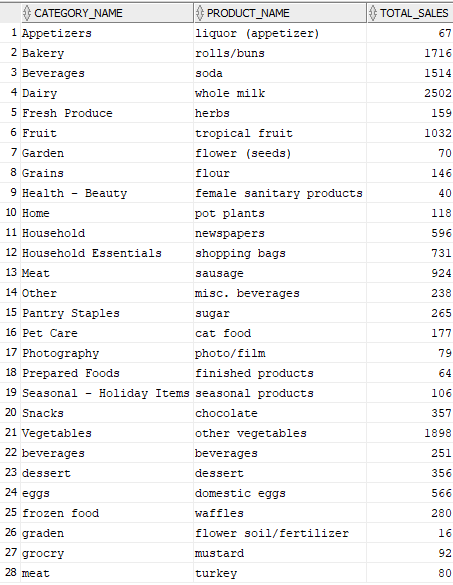
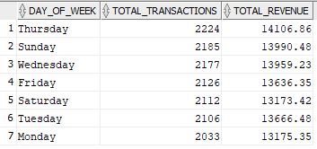
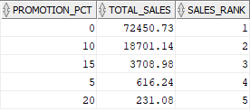
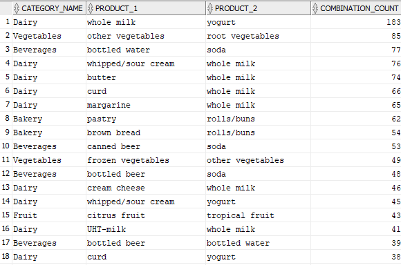

# Walmart-Data-Analytics
Walmart deals with millions of transactions daily. To make sense of this data, the business needs a 
structured way to store and retrieve it for analysis. The CEO wants to understand which products 
are most popular, which customer demographics spend the most, and how sales vary over time.
# Business Story: 
Imagine you're helping Walmart solve this problem. The CEO and department managers rely on you 
to create a system that allows them to quickly answer questions like: 
* What are the top-selling products in each category? 

* How do purchasing patterns change based on time? 

* Which types of promotions result in the highest sales?

# Identify Frequently Bought Together Items 
## Business Problem: 
Walmart managers noticed that customers often buy certain items together, but they don’t have 
clear data on which combinations are the most frequent. They need this insight to optimize store 
layout and improve cross-selling strategies. 
What You Need to Do: 
Write a query to find products that customers frequently purchase together. The results should: 
* Highlight popular combinations within the same category, excluding items that are just 
variations of each other (e.g., two types of milk count as one). 
* Show the number of times these combinations were purchased together, sorted by the 
most frequent pairs.

# Most Common Product Pairs:
Dairy:
Whole Milk + Yogurt: A staple pairing for breakfast or snacks.
Whipped/Sour Cream + Whole Milk: Likely used together in recipes.
Butter + Whole Milk: Common for baking or cooking.
Vegetables:
Other Vegetables + Root Vegetables: Often used together in meals.
Beverages:
Bottled Water + Soda: Frequently purchased together for convenience.

Store Reorganization:
Place Complementary Products Together:
Move Yogurt closer to Whole Milk in the Dairy section.
Place Root Vegetables near Other Vegetables in the Produce aisle.
Display soda next to bottled water in the beverage section.

If customers frequently buy products from different categories together (e.g., Dairy and Vegetables), consider creating cross-category displays near checkout counters.

# Key Insights from Analysis
Top Product Pairs:
Dairy: Whole Milk + Yogurt,  the most frequent pairing in the entire dataset.

Vegetables: Other Vegetables + Root Vegetables, critical for meal preparation.

Beverages: Bottled Water + Soda, a convenience-driven duo.

Dairy Dominance: 8 of the top 10 pairs involve Whole Milk, showing its role as a staple cross-sold with complementary items like butter, yogurt, and whipped cream.

Customer Behavior Trends:

Shoppers frequently combine complementary items (e.g., baking ingredients, meal components).

Weekend shoppers often buy snack/drink bundles (e.g., soda + water).

Actionable Recommendations
1. Store Layout Optimization: 
Place Complementary Products Adjacently:
Move Yogurt next to Whole Milk in Dairy.
Cluster Root Vegetables with Other Vegetables in Produce.
Position Soda beside Bottled Water in Beverages.
Create Cross-Category Displays:

2- Offer Weekend Specials:
Soda + Bottled Water bundles for family gatherings.
Introduce Loyalty Rewards:
Buy 5 Whole Milk + Yogurt combos, get 1 free.

3. Inventory Management
Stock High-Demand Pairs Together:
Ensure Whole Milk and Yogurt are always in stock during peak hours (evenings/weekends).
Anticipate Seasonal Demand:
Increase Whipped Cream inventory near holidays (e.g., Thanksgiving pies).

